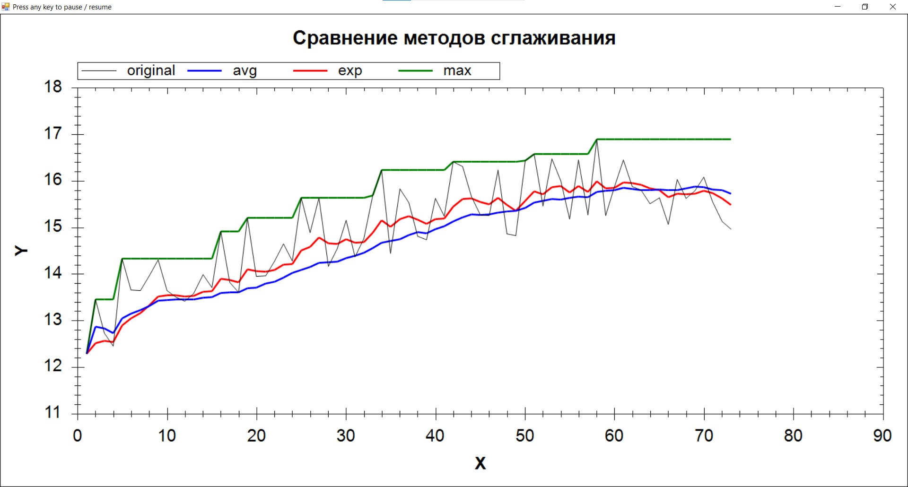


# Практики «Экспоненциальное сглаживание», «Скользящее среднее» и «Скользящий максимум»
Репозиторий содержит решения [этой](https://ulearn.me/course/basicprogramming2/Praktika_Eksponentsial_noe_sglazhivanie__c334ede2-2c35-4fcb-94cb-fb1c48e3e7bb), [этой](https://ulearn.me/course/basicprogramming2/Praktika_Skol_zyashchee_srednee__26c11465-87ec-4e5c-bed9-36987826b503) и [этой](https://ulearn.me/course/basicprogramming2/Praktika_Skol_zyashchiy_maksimum__361506eb-0938-4f41-817f-1d035037b368) задачи с ulearn.me.
Задачи прошли код-ревью у преподавателя (баллы: 50/50, 100/100, 50/50). Все решения курса на максимальный балл также выложены в других репозиториях.
Ветка unsolved содержит изначальный проект.



Конечное приложение - изменяющийся график с демонстрацией методов для сглаживания графика.

## Практика «Экспоненциальное сглаживание»

В классе ExpSmoothingTask реализуйте функцию экспоненциального сглаживания данных.

Отладьте реализацию с помощью приложенных модульных тестов. Запустите тестирующее приложение и объясните наблюдаемый результат.

[Экспоненциальное сглаживание в википедии](http://en.wikipedia.org/wiki/Exponential_smoothing#The_exponential_moving_average)

### Использование методов IEnumerator

В этом модуле вы изучили интерфейс IEnumerator. Однако использовать напрямую методы этого интерфейса в своём коде как правило не нужно. Для перечисления элементов есть оператор foreach и методы LINQ. В отличие от интерфейса IEnumerator, они просты в использовании и легко читаются. Используйте работу через методы IEnumerator только, если задача не решается с помощью foreach или уже готовых методов LINQ.

В частности, вся серия задач данного модуля решаются без использования методов IEnumerator.

## Практика «Скользящее среднее»

В классе MovingAverageTask реализуйте функцию скользящего среднего.

При усреднении с окном размера W, первые W-1 точки результата в действительности должны усредняться по окнам меньшего размера. Так, первая точка должна попасть в результат без изменения. Отладьте реализацию с помощью приложенных модульных тестов.

Запустите тестирующее приложение и объясните наблюдаемый результат.

[Скользящее среднее в википедии](https://en.wikipedia.org/wiki/Moving_average#Simple_moving_average)

### Queue

Для этой задачи вам пригодится структура данных Очередь. Не нужно создавать её самостоятельно, воспользуйтесь готовым классом Queue в пространстве имён System.Collections.Generic.

## Практика «Скользящее среднее»

В классе MovingMaxTask реализуйте функцию максимума в скользящем окне. Для каждой точки найдите максимум всех предшествующих точек в окне указанного размера. Алгоритм должен работать эффективно, то есть тратить на обработку одной точки в среднем O(1) времени, вне зависимости от размера окна.

Эта задача не так проста как кажется, поэтому ниже описана идея простого и компактного алгоритма, до которого, тем не менее, не так просто догадаться самостоятельно. Впрочем, у задачи существуют разные решения. Допустимы любые решения с требуемой сложностью.

### Идея алгоритма

Итак, давайте как и в прошлой задаче  `MovingAverageTask`  хранить элементы текущего окна.

Мы не хотим пересчитывать максимум заново на каждой точке — это даст сложность обработки O(WindowSize), что слишком медленно по условию. Поэтому используем вспомогательную структуру данных, которая поможет это делать быстрее.

Будем отдельно хранить список только тех значений окна, которые потенциально могут стать максимумом в будущем. Значение не может стать максимумом, если после него в окно попало хоть одно значение больше него. Поэтому перед добавлением очередного элемента в этот список (будем считать, что добавляем мы справа) нужно удалить справа все элементы, меньшие нового. Несложно понять, что этот список будет упорядоченным, а значит максимум всех чисел в текущем окне будет в этом списке самым левым.

Для хранения этого списка потенциальных максимумов пригодится структура данных  [Deque](https://en.wikipedia.org/wiki/Double-ended_queue)  (LinkedList в языке C#), в которой эффективно добавлять и удалять элементы можно с обоих концов списка.

### Пример

Рассмотрим как будут выглядеть окно и список максимумов на каждой итерации обработки последовательности 2, 6, 2, 1, 3, 2, 5, 8, 1 с окном размера 5.

```
| № | Окно          | Список потенциальных максимумов |
|---|---------------|---------------------------------|
| 1 | 2             | 2                               |
| 2 | 2, 6          | 6                               |
| 3 | 2, 6, 2       | 6, 2                            |
| 4 | 2, 6, 2, 1    | 6, 2, 1                         |
| 5 | 2, 6, 2, 1, 3 | 6, 3                            |
| 6 | 6, 2, 1, 3, 2 | 6, 3, 2                         |
| 7 | 2, 1, 3, 2, 5 | 5                               |
| 8 | 1, 3, 2, 5, 8 | 8                               |
| 9 | 3, 2, 5, 8, 1 | 8, 1                            |
```

Отладьте реализацию с помощью приложенных модульных тестов.

Запустите тестирующее приложение и объясните наблюдаемый результат.

